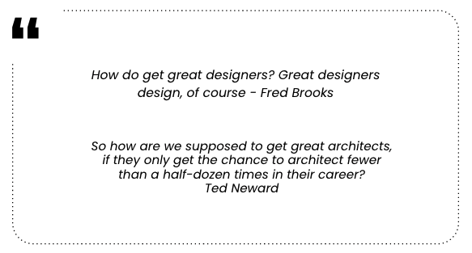

Last week, I had the opportunity to facilitate an Architectural Kata in the [Caceres DevOps](https://www.meetup.com/es-ES/caceres-devops/) meetup group. The purpose of this post is to explain the importance of these katas and share the workshop format in case it can be helpful to someone else.

### What is an Architectural Kata?

Inspired by Ted Neward’s [Architectural Katas](https://archkatas.herokuapp.com/index.html), an Architectural Kata is a workshop where several groups (3-5 people) practice discussing and designing architectures.

The groups receive a project that needs development. They meet for a while, discover requirements by collaborating with the facilitator, discuss technology options and sketch a rough vision of what the solution could look like. Then, after they have worked for a while, all the groups present their solutions to other teams and answer challenges from them.

### Why an Architectural Kata?

The architecture design should not be a task for just one person (a.k.a. ivory tower architect). Instead, when the opportunity to design comes up, the whole team should get involved.

However, we need to practice if we want to have good results. Without that training, we will not be prepared when we need to design something. This is the main motivation behind these architectural katas. As we do with code katas, which are used for practicing TDD or other practices, it's useful to try architectural katas.

### The kata

In this section, we can see the agenda and timing that we had in the Caceres DevOps meetup last week. Depending on the number of participants and the context, there can be some variations. For more information, check out the rules on the [Architectural Katas website](https://archkatas.herokuapp.com/rules.html).

#### Participants

We were 11 people in the session. As I was the moderator, I split the participants into two groups of 5 people. If we had reached 12 participants, I would have divided them into three groups of four. As long as you're within 3-5 participants per group, it's fine.

#### Preparation

I only did two things before the workshop:

* **Prepare the exercise**: I chose a random exercise from [Neal Ford’s architectural katas website](https://nealford.com/katas/random.html).

* **Material**: bring some post-its, paper, and markers for the exercise. Participants will use them.

#### The exercise

We split the session into four parts:

* **Introduction (10’-15’)**: we read the exercise requirements together. Although participants can make questions and take some assumptions during the resolution, it’s a good moment to resolve doubts about the problem.

* **Design (1h 20min)**: problem resolution. As I said above, we split the session into two groups. They worked during this time in order to find a good architecture for the given problem.

* **Presentation (20’)**: a member of each group presented the group’s solution to other participants. This is a very important part of the exercise, as it is always very interesting to see how people solve the same problem in different ways. We can learn a lot during this phase.

* **Retrospective (10’)**: we made a small retrospective. In this part, we tried to find some things to improve and reflect on our new learnings.

Depending on the duration, I believe the **Design** part can be longer with hourly breaks (1h design - 10’ break - 1h design). As we wanted to finish the session in less than 2 hours, I proposed this format.

### Conclusion

Teams should be in charge of defining the architecture of the services that they work on. However, designing a project only occurs a few times in our careers, so we are not usually prepared.

Architectural katas are a great way to improve our ability to design, as it helps us to:

* Identify the main components of a software architecture.
* Improve our ability to make and explain decisions.
* Learn from other people.
* Discover new ideas, frameworks, or technologies.

I hope this post helps people to organize similar activities in their companies and communities. Please, [contact me](mailto:fortizabril@gmail.com) if you have any other doubt.
