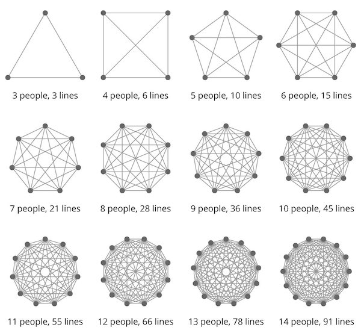

The [delivery lead time](https://itrevolution.com/measure-software-delivery-performance-four-key-metrics/) is the time it takes to go from a customer making a request to the request being satisfied. So, improving this time should be a goal for every organization. A major decelerator for this delivery flow is that the different teams in an organization have been traditionally working in silos, with a ticketing system as the unique communication channel. This is tragic when you have some team dependencies, which is something that usually happens.

To tackle this problem, a simple solution emerges in most cases: Increase the communication between the different teams.

But, is this solution enough? How does the "increase communication solution" scale when the company grows? We will explain some of those things in this article but, as a spoiler: **having proper team interactions is a complex problem, and complex problems rarely have simple solutions**.

#### How cross-team communication scales

Having good cross-team communication and good collaboration is necessary. Also, when starting a product, the most effective way to work is having strong horizontal communication between individual team members, asking each other for help any time they need it. There are no blocks, features don’t have idle time so the lead time does not suffer.

However, this type of communication doesn’t scale well. When we have team dependencies that require continuous communication between the different team members, the delivery lead time for any feature can be affected as the number of members in the organization increase. Let's see with a figure from the [Brooks Law](https://www.leadingagile.com/2018/02/lines-of-communication-team-size-applying-brooks-law/):

As we can see, as the number of team members increases, the possible communication lines' growth rate is very high. If this communication is necessary because the teams are waiting for external dependencies many features will sit idle, teams will have context switching until they get the responses they are waiting for, etc.

So... what should we do?

#### Define your team interaction modes to remove dependencies

As we said, good communication is necessary and good. But the problem here is not the communication quantity, but the quality. We need to define the team interactions in a way that removes team dependencies as much as possible, removing the communication at all where it should not be necessary. From [Accelerate](https://itrevolution.com/accelerate-book/):

_"In teams which score highly on architectural capabilities [which directly lead to higher performance], little communication is required between delivery teams to get their work done, and the architecture of the system is designed to enable teams to test, deploy, and change their systems without dependencies on other teams."_

The [Team Topologies](https://teamtopologies.com/) book approaches this communication problem, defining four fundamental team topologies and three team interaction modes:

The team topologies are:

* **Stream aligned team**: aligned to a flow of work from (usually) a segment of the business domain.
* **Enabling team**: helps a Stream-aligned team to overcome obstacles. Also detects missing capabilities.
* **Complicated Subsystem team**: where significant mathematics/calculation/technical expertise is needed.
* **Platform team**: a grouping of other team types that provide a compelling internal product to accelerate delivery by Stream-aligned teams.

About the interactions, they present the three interaction modes below:

* **Collaboration**: teams work together for a defined period of time to discover something.
* **X-as-a-Service**: one team provides and one team consumes something "as a service".
* **Facilitation**: one team helps and mentors another team.

Depending on the team topologies, they propose to try an interaction mode or other.

When you want to apply these concepts, there are no right or wrong answers without knowing the specific team context. But checking your current team interactions and evaluating them is a good starting point. Some examples:

* In my current company, [Audiense](https://audiense.com/), the **stream-aligned** teams needed a "**collaboration** interaction" with the systems team each time they wanted to create some infrastructure components, such as a new queue, event topic, etc. The stream-aligned teams didn’t have this infrastructure creation part within their development process, so that collaboration was always at the end of the feature development, leading to some blocks.
Since some months ago, the **Platform team** has created a service where the different stream-aligned teams are able to create that infrastructure components writing some code, and the components are automatically created in the CI process. That interaction is **X-as-a-Service now**, and we have removed that dependency. We now have other parts where we are doing the same, but that dependency was causing many blocks.

  For similar cases: does it make sense to have a collaboration interaction mode for a long time in parts where you can afford an X-as-a-Service one?

* If you usually need to wait for some people to make some decisions: does it make sense? Can you remove that dependency by having a **facilitation** interaction mode during a specific time?

Those are the type of questions you should ask yourself.

As always, **approach the problem as a continuous process, taking small steps** to improve your current situation:

* Evaluate your current team dependencies and their interaction modes.
* Take the blocking dependencies first so features don't sit idle any more, these dependencies are your current bottleneck.
* Update that interaction mode and remove that dependency.
* Find the next bottleneck.
* Start again.

**Do you have any experiences applying these interaction modes between your teams?** Please, [contact me](mailto:fortizabril@gmail.com) and share it!

##### References

* Software delivery performance. Four key metrics https://itrevolution.com/measure-software-delivery-performance-four-key-metrics/
* Brooks Law: https://www.leadingagile.com/2018/02/lines-of-communication-team-size-applying-brooks-law/
* Accelerate: https://itrevolution.com/accelerate-book/
* Team topologies: https://teamtopologies.com/
* Why I hate the phrase “breaking silos”. Charity Majors. https://charity.wtf/2021/08/27/why-i-hate-the-phrase-breaking-down-silos/
