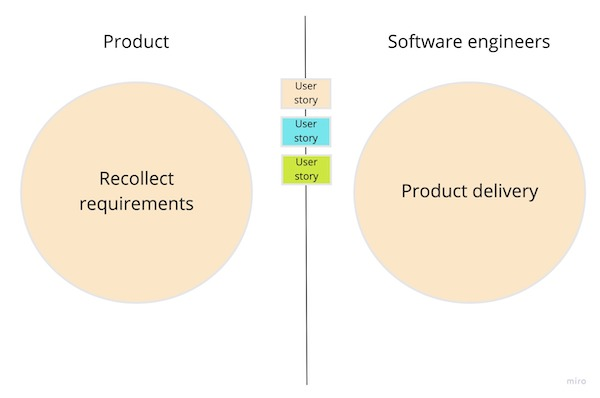

The product development process consists of two different activities: decide what to do and decide how to do it. The part related to "the what" is called product discovery and the one related to "the how" is the product delivery.

Traditionally, software engineers have not participated in the product discovery part. The business team makes decisions, product owners convert those decisions into requirements for the software engineers and they implement the given solutions, called user stories.

This is what Marty Cagan defines as a [feature team](https://svpg.com/product-vs-feature-teams/).

The success of these teams is measured by the number of user stories they complete within a given period of time.

But this is not the best approach to do product development. The purpose of a product team should not be just to deliver new features given by business requirements. **The value of a product is not just in the number of features (the output), but in solving the right problems for the customer (the outcomes)**.

In [Accelerate](https://itrevolution.com/accelerate-book/), we can see the following capabilities as higher organizational performance predictors:

* Whether teams have a good understanding of the flow of work from the business all the way through to customers, and whether they have visibility into this flow, including the status of products and features.
* Whether development teams have the authority to create and change specifications as part of the development process without requiring approval.

As a result of this paradigm shift, a new role is emerging within software engineers: the product engineer.

#### What is a product engineer?

Product engineers are software developers with a lot of interest in the product that they are working on. Apart from implementing solutions, they want to understand why problems deserve to be solved, how people use the product, and participate in the decision-making.

From my point of view, these are the main capabilities of a product engineer:

##### They understand the product

Product engineers want to understand the "why?" behind all things. They want to know how and why the product is successful.

* How is the company making money?
* What problem does the product solve?
* Who are the users? How much do they pay?

The more engineers know about this, the better decisions they will make for the company.

##### They have product ownership

In the same way that they have ownership of the code that they ship, product engineers have product ownership. As we said before, product engineers participate in the whole value chain, from the decision-making to validating business metrics after the release.

They do not consider the work as done when a feature is released, that’s the moment when they actively start to follow up if the feature is meeting the expectations. If that is not the case, they attempt to figure out what went wrong and iterate on another solution.

##### They work as a team

Product engineers see product development as a team activity, where each team member provides a unique skill set and expertise to the team. They have good communication skills, having a strong relationship with the product manager, who is also part of the team.
Rather than having two separate teams (product and engineering) in charge of the discovery and delivery parts respectively, they work as a single product team, trying to resolve the customer problems together.

##### They offer new ideas and tradeoffs

As they understand how the product and the business work, they are able to bring new ideas and tradeoffs to the table. Some examples:

"We think we can improve the speed of our site in an X% using the technology Y. This would improve the metric Z in an N%".

"We could also test this other solution to solve problem X, the product impact would be similar and the engineering effort is extremely smaller".

##### They have empathy with users

They care about the experience the users are having with the product, making sure they are getting the expected benefit from it. They have access to all available business and user metrics and they are curious about this.

##### Technology is a means, not an end

They are software developers, but they don’t see the software as an end. They are focused on providing the best possible experience to the product users and software is useful in achieving that goal.

They don’t choose technology because it’s cool, they make those decisions based on the problem that they are trying to resolve.

##### They are proud of what they do

Product engineers are aware of how their work affects users. They are proud of the product they build and how it impacts their customers' lives.

##### They are ordinary but empowered people

We are enumerating many different capabilities of product engineers, but they do not have to be extraordinary as individuals. Instead, they are ordinary but empowered people.

* They are empowered with all the necessary business context to do their job. The company needs to provide it. Otherwise, it’s difficult for these people to do their job.
* They are empowered because they work as a team: there are many different skills and experiences in a product team. As a result, all the team is empowered with all these skills to resolve the business problems.
* They are empowered with trust: because of this teamwork, people establish a huge level of trust in their teammates. This is really important to do their work properly.

#### Summary

Product engineers are a key ingredient to building a successful product. We have enumerated some capabilities that these people share:

1. They understand the product.
2. They have product ownership.
3. They work as a team.
4. They offer new ideas and tradeoffs.
5. They have empathy with users.
6. Technology is a means, not an end.
7. They are proud of what they do.
8. They are ordinary but empowered people.

We have also found that these people cannot excel without the proper company context, since they must understand the business that they are working on. Even though this isn't the most common scenario in software companies, I think that product teams are on the rise within our industry.

If you work for a product company: Do you consider yourself a product engineer? Do you have the proper environment to do your job? It would be a pleasure if you [contact me](mailto:fortizabril@gmail.com) and share your experience.

#### Related Content

* Empowered Product teams: https://svpg.com/empowered-product-teams/
* Comunicación efectiva con ingenieros de software (Spanish): https://www.estrategiadeproducto.com/p/comunicacion-ingenieros-software
* Equipos de alto rendimiento: qué son y cómo identificarlos (Spanish) https://www.youtube.com/watch?v=Eqwy6w2RYUk
* Accelerate: https://itrevolution.com/accelerate-book/
