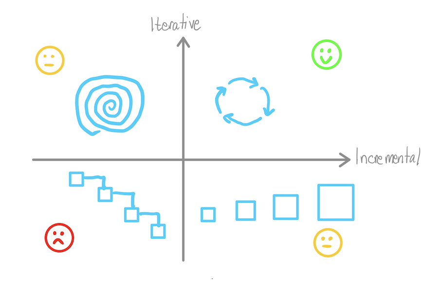

We usually speak about iterative and incremental as the same thing in product development. However, they are different ideas with different purposes. This article will show some differences between these ideas and how we usually apply them.

Let's start with some definitions:

* **Incremental development** means adding software incrementally. A product target is sliced into fully working slices called increments. Each increment adds a new piece of software on top of the existing released functionality. After some increments, we get our target.

* In **iterative development** we build something, then we evaluate if it is working for us, making the necessary changes after that evaluation. **We build things expecting to change them, **without expecting to be right with the first solution. The objective is to build the smallest possible thing to get feedback and then iterate over it. Sometimes we are right and we don't need to iterate as much, but that isn't the usual behavior.

From the definitions, we can see that incremental development is about making something bigger through new additions. Iterative development is about making something better through continuous improvement.

In product development, it's important to have a combination of both iterative and incremental approaches. However, although we have adapted our practices to work more incrementally, I think that working iteratively is not something usual in our industry.

### We work incrementally, but not iteratively

We have improved our practices to work in a more incremental way. Many teams try to work in small batches and practices like continuous delivery or trunk-based development help to do it.

This incrementalism is really good, however, **iteration is often discarded in favor of new features. Also, we don't see any problem, as success is defined as launching as many features as possible. **So, many teams just tend to take a large project, divide it into smaller pieces, and then start working on it. This looks like the most optimal approach, but it has some problems.

#### We don't usually know what users want

We would not need iterations if we could know users' needs, make a plan and implement the necessary things to fulfill those needs without deviations from the initial plan. However, this is not usual. According to [some experiments from Microsoft](https://ai.stanford.edu/~ronnyk/ExPThinkWeek2009Public.pdf), two-thirds of their ideas produce zero or negative value. There are similar experiments from other big companies. We are terrible at guessing what users want.

Without iterations, even if we work incrementally, we only decide what to do once, at the start of the development. **When we implement our first ideas we are at a terrible risk of building something that users will not want**. Apart from that, we usually have the [sunk cost fallacy](https://thedecisionlab.com/biases/the-sunk-cost-fallacy) present: when we invest much time in planning and building a solution, it will be very hard to remove it. The result is a product where many features are unused.

So, we need to find ways to try our ideas with minimum cost. When we accept that many of our ideas will be wrong, we start to see iterative development as the most effective approach**.**

#### We don't take care of the resulting product

In incremental product development, each increment adds a new piece of software on top of the existing product.** Without iterations, we have an only-growing product where we don't spend time evaluating if all the features fit well together.** A typical example of this problem is the [Sutyagin house](https://en.wikipedia.org/wiki/Sutyagin_House).

### Working incrementally and iteratively

Incremental and iterative approaches have different objectives: Iterating over a solution helps us **to build the right thing, **whereas working incrementally helps **to build the thing right.**

So, ideally, we want to have a combination of both incremental and iterative approaches. During an iteration, we would add every new feature in an incremental way.

There are some practices and principles that we might include in our workflow to work this way:

* **Customer interviews**: talk with your users and recollect feedback, it's the best way to fulfill their needs. These interviews shouldn't just be done at the beginning of a project, it should be a continuous process.

* **Metrics review:** by reviewing metrics, we can get useful information about how users use our product. Then, we can use this information to iterate over it.

* **Delete unused features:** we will build the wrong thing many times, it's normal. If a feature is not providing anything useful to your product, delete it. Keeping unused features increases the complexity of the final product and does not add any value. Producing more features is not always a gain. **[Code is a liability. What the code does for you is the asset.](https://wiki.c2.com/?SoftwareAsLiability)**

* **Small batches: **when we build a new feature, we want to recollect feedback and iterate over it. In case a feature does not work as expected, the smaller the work batch, the less risk we take. Also, working in small batches gives us confidence that our new changes are properly integrated with the rest of the product, even if we are not testing anything with real users.

* **Continuous delivery: **continuous delivery is a necessary condition if we want to iterate over features. Getting feedback from users requires the ability to continuously deploy new changes to production. Also, as we mentioned with small batches, continuous delivery gives us confidence that our new changes are properly integrated with the rest of the product.

* **YAGNI (You Aren’t Gonna Need It):** this principle encourages us to solve today’s problems, not tomorrow’s. We need to avoid implementing solutions because “we are gonna need it someday”. Maybe we need it, but it’s better to postpone that implementation to that moment (see [Defer Commitment Lean principle](https://www.planview.com/resources/articles/lkdc-principles-lean-development/#:~:text=Defer%20Commitment%20does%20not%20mean,decisions%20without%20the%20necessary%20data)). We will avoid over-design and over-building and our solution will be better, as we will have more information about the problem. As we want to do with our product features, we should implement the technical solutions iteratively. YAGNI helps us with this.
**YAGNI, however, does not mean that we don't invest the necessary time to keep good quality in our code**. We want the simplest solution for today’s problem, but it does not mean that the quality of the solution is not good. As the [Defer Commitment Lean principle](https://www.planview.com/resources/articles/lkdc-principles-lean-development/#:~:text=Defer%20Commitment%20does%20not%20mean,decisions%20without%20the%20necessary%20data) principle says: it does not mean that teams should be irresponsible about their decision-making. Instead, they should keep their options open.

### Conclusion

We have seen the difference between incremental and iterative development. Also, we mentioned that, although we are moving toward incremental development, iterative product development is less common in our industry, leading to several problems:

* It's difficult to build the right thing.
* Only-growing products with many features that don't fill well.

We want a combination of both incremental and iterative product development, and we have reviewed some practices and principles to get there:

* Customer interviews
* Metrics review
* Delete unused features
* Small batches
* Continuous delivery
* YAGNI (You Aren't Gonna Need It)

Checking the quadrant below, our goal is to be in the upper right quadrant. Iterative practices will be used to **build the right thing**, and incremental practices will be used to **build the thing right**.

What's your experience with iterative product development? It would be a pleasure if you [contact me](mailto:fortizabril@gmail.com) and share it.

Thanks to [@eferro](https://twitter.com/eferro) and [@saski](https://twitter.com/saski) for the feebdack, the article was improved based on it.

### Related content

[YAGNI, yes. Skimping, no. Technical Debt? Not even](https://ronjeffries.com/articles/019-01ff/iter-yagni-skimp/) - Ron Jeffries

[Don't Know What I Want, But I Know How to Get It](https://www.jpattonassociates.com/dont_know_what_i_want/) - Jeff Patton

[El arte del patadon pa'lante / postponer decisiones](https://www.eferro.net/2016/12/el-arte-del-patadon-palante-posponer.html) - Edu Ferro

[Software as Liability](https://wiki.c2.com/?SoftwareAsLiability) - Ward Cunningham
