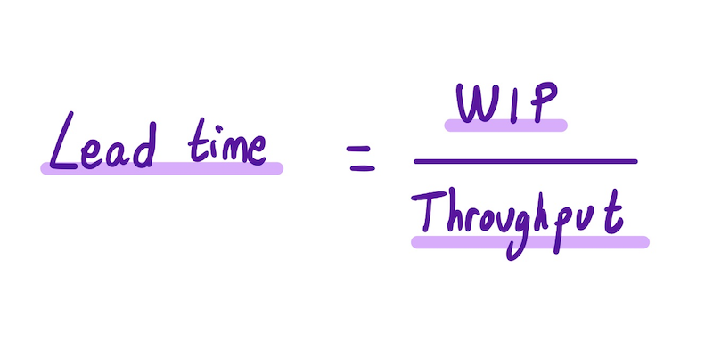

Improving the [delivery lead time](https://itrevolution.com/measure-software-delivery-performance-four-key-metrics/) is a goal for every organization. In this article, we will explore [Little's Law](https://en.wikipedia.org/wiki/Little%27s_law), a mathematical theory that relates lead time to the amount of work in progress and to the team's throughput.

### Little’s Law

Little’s Law comes from [queueing theory](https://en.wikipedia.org/wiki/Queueing_theory). It states the following:

_“The long-term average number L of customers in a stationary system is equal to the long-term average effective arrival rate λ multiplied by the average time W that a customer spends in the system.”_.

Algebraically, the law is: _L = λW_

Little’s Law is present in every queue. Some examples where it appears are:

* Number of customers in a store
* Number of messages in a queue
* Number of user stories in a product backlog

In this article, we will focus on the last use case: the number of user stories in a product backlog. Considering the product backlog as our stationary system, we could define the Little’s Law as:

__The average team’s delivery lead time is the number of work-in-progress tasks divided by its throughput.__

where:

* **Lead time** is the average time a task spends in the backlog.
* **WIP** is the average number of in-progress tasks.
* **Throughput** is the average amount of work a team can complete in a certain period of time

From the formula, we can see that we have two options to improve lead time: **reduce the amount of work in progress** or **increase the throughput**.

### Reduce Work In Progress

Work in progress (WIP) refers to the work that has been started but not yet finished. When we set a WIP limit, we are forced to prioritize and select the tasks to implement**.** If the WIP limit is reached, nobody is allowed to start new work. Instead, all people should help to finish the ongoing work.

As John Cutler explains [here](https://cutlefish.substack.com/p/tbm-4052-why-limiting-wip-starting?s=r), **limiting WIP is hard**. We usually have the goal of having everyone busy, and any other choice is considered ineffective. In fact, any other decision seems counterintuitive.

With Little’s Law, we have mathematical proof that reducing WIP is a better strategy if we want to finish our work early. **We don’t want resource optimization, we want to optimize the flow** in the queue. We want to **[stop starting and start finishing](https://www.goodreads.com/book/show/16208052-stop-starting-start-finishing).**

#### How to reduce WIP

* **Do fewer things**: this may look obvious, but it forces us to make decisions and discard some ideas. Otherwise, we will have a never-ending backlog and a lot of pressure to start new work. Steve Jobs said: _“People think focus means saying yes to the thing you’ve got to focus on. But that’s not what it means at all. It means saying no to the hundred other good ideas that there are. You have to pick carefully.”_.

* **Pair / Mob programming: **pair/mob programming is also an excellent approach for reducing WIP. Instead of assigning one task to each developer, try to solve the problem together. As we said, our goal is to complete the task as soon as possible, not to start as many as possible.

### Increment throughput

In Kanban, throughput refers to the amount of work delivered over a certain period of time. Example: the number of tasks a team can complete on a weekly basis.

While the current amount of work in progress can be reduced instantly, increasing the team's throughput is not as simple. There are no immediate actions that produce a better team performance. However, there are some decisions that can improve this throughput in the long term.

* **Improve the team's technical practices: **practices like [trunk-based development](https://cloud.google.com/architecture/devops/devops-tech-trunk-based-development), [automatic testing](https://cloud.google.com/architecture/devops/devops-tech-test-automation), or [continuous delivery](https://cloud.google.com/architecture/devops/devops-tech-continuous-delivery) improve the software delivery performance, so the throughput will increase.

* **Improve team’s autonomy**: teams should be autonomous to complete a task. When a team needs to wait for external dependencies to complete their work all the time, the lead time is really affected. This topic was covered further in the [Cross-Team Communication: avoid dependencies](https://productdeveloper.net/cross-team-communication-avoid-dependencies) post.

* **Work in small batches: **by working in small batches, we can quickly validate if changes have the desired effect. If not, it lets us make the proper corrections. As a result, we avoid spending a lot of time working on a bad solution so we improve the throughput.

* **Hiring more people:** this always can be a valid solution. However, remember to be careful, as the team throughput does not grow in the same way as the number of people in the team. The more people in the team, the more needed coordination for the team to perform well. If the required coordination is too high, the team throughput can decrease when we add more people to the team. That’s why we have some rules like the [Two-Pizza Teams](https://docs.aws.amazon.com/whitepapers/latest/introduction-devops-aws/two-pizza-teams.html).

### Summary

When working on any queue, we should keep in mind that the goal is to optimize for fast flow, reducing the lead time as much as possible.

In this article, we have seen Little’s law, a powerful and simple mental model that establishes a relationship between the lead time, the number of in-progress tasks, and the team throughput. In order to have the shortest lead time, we should try to reduce the number of work-in-progress items and increase the throughput.

We have focused on a product backlog queue, but remember that this model is valid in any other queue. If you are optimizing a process that involves a queue, consider simulating your use case with this law.

What is your experience with Little's Law? Please [get in touch](mailto:fortizabril@gmail.com) and let me know.

### Related content

[High WIP, Online Whiteboard for Visual Collaboration](https://www.loom.com/share/5efceb288b634a449041918bdba08202) - John Cutler (@johncutlefish)

[Why Limiting WIP, Starting Together, Being Less Busy, and Working Together is SO HARD ](https://cutlefish.substack.com/p/tbm-4052-why-limiting-wip-starting?s=r)- John Cutler (@johncutlefish)

[Explaining flow](https://github.com/michelgrootjans/explaining-flow) - Michel Grootjans (@​michelgrootjans)

[Escalabilidad: bases y aplicación a sistemas, equipos y procesos](https://www.youtube.com/watch?v=yPqHK5fjJ10) - Talk with Edu Ferro (@eferro) in the Caceres Devops Days 2020
