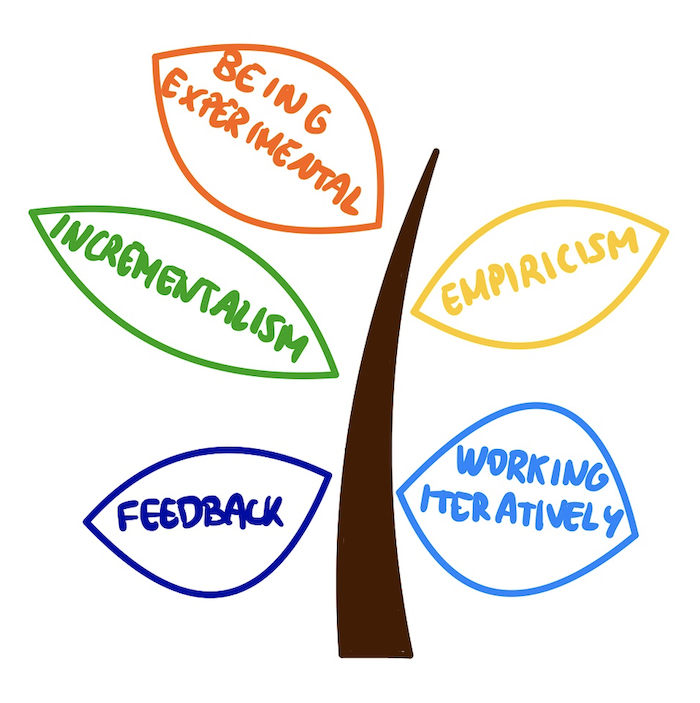
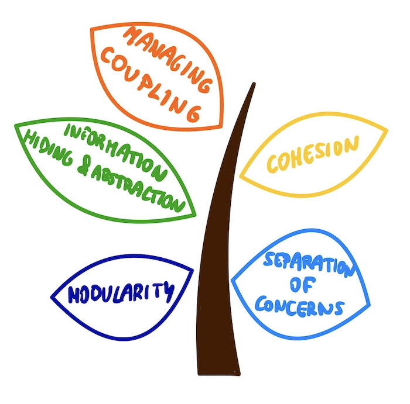
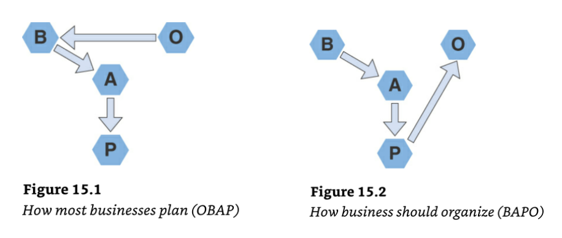

I’m starting a new category on this blog: book reviews. When I read a book, I don't always take the time to reflect on what I learned. My purpose in writing these articles is to share a quick summary of some books I find interesting, along with some opinions and learnings I am taking from them.

My first choice is a book I just finished last month: [Modern Software Engineering](https://www.amazon.com/-/es/David-Farley/dp/0137314914) by [Dave Farley](https://twitter.com/davefarley77).

As a frequent viewer of the [Continuous Delivery](https://www.youtube.com/c/ContinuousDelivery) channel, I had some doubts about reading this book, since I’m already very aligned with Dave Farley’s ideas :). Finally, I decided to read it and I enjoyed it. **Modern Software Engineering is a book for anyone working or aspiring to be a software engineer**. It presents a series of related ideas, advice, and technical practices that can have a significant impact on the quality of our work.

### What is Software Engineering?

The book starts presenting **software development as an engineering practice.** This definition has always been something controversial for me, as we have sometimes separated the word “engineering” from software development. As Dave Farley says, this separation comes from the attempts of our industry of treating software development as a production line, designing waterfall processes where there is no discovery, learning, or experimentation. Software engineering is a different problem. Software is not a production problem (physical things with a high cost of replication) so we need to use different tools for software development: testability, experiments, continuous delivery.

Taking these things into account, Dave presents the following definition for software engineering:

_“Software engineering is the application of an empirical, scientific approach to finding efficient, economic solutions to practical problems in software”._

To master software engineering, we must become **experts at learning and experts at managing complexity**. Software development requires continuous discovery and learning, so that's why we should master the **learning** part. To do this sustainably, we must manage the **complexity** of our systems.

### Optimize for learning

Software engineering is a complex and creative discipline, a continuous exercise of exploration and discovery. In many cases, we don’t even completely understand what we are building so it’s very important to explore our customer's needs, try to figure out how to solve the problem presented, or try to discover new tools to improve our work.

So, to master software engineering, we should focus on improving our skills of **exploration**, **discovery**, and **learning**.

To highlight the importance of continuous learning in software development, I also love the driving metaphor from the [Extreme Programming book](https://www.oreilly.com/library/view/extreme-programming-explained/0201616416/):
_“Driving is not about getting the card going in the right direction. Driving is about constantly paying attention, making a little correction this way, a little correction that way”_

To optimize for learning, the book presents five behaviors to consider:

* **Working iteratively**
* **Feedback**
* **Incrementalism**
* **Empiricism**
* **Being Experimental**

**The main idea is to work on small steps, collect feedback, and adjust.** We usually fail to guess what users want. According to some studies, two-thirds of the ideas that come from top software companies fail to produce the expected value (here you have examples from [Microsoft](http://ai.stanford.edu/~ronnyk/ExPThinkWeek2009Public.pdf) or [Amazon](https://www.businessinsider.com/amazon-products-services-failed-discontinued-2019-3?r=MX&IR=T#haven-2)). If these companies are making mistakes, then we will too :) So the important thing is to test our ideas effectively so that we can discard the bad ones as soon as possible.

This part of the book also reminds me of the [DevOps Handbook](https://itrevolution.com/the-devops-handbook/) book, with the [Three Ways of DevOps](https://itrevolution.com/the-three-ways-principles-underpinning-devops/):

* The first way: **System thinking**
* The second way: **Amplify Feedback Loops**
* The third way: **Culture of continual experimentation and learning**

### Optimize for managing complexity

As a company grows, if we want to be able to scale, we need to manage the complexity of our systems.

We can start to work on a small idea without taking design decisions but, if our system grows and we want to scale beyond a single team we need to consider these ideas. Otherwise, we will end up with big-ball-of-mud systems, a huge number of bugs and technical debt, etc.

The book presents other five ideas to manage complexity:

* **Modularity**
* **Cohesion**
* **Separation of Concerns**
* **Information Hiding and Abstraction**
* **Managing Coupling**

### Tools to support engineering in software

In this block, Dave Farley examines some of the ideas discussed throughout the book, exploring them in more depth and showing some practical examples.

The presented ideas are:

* Testability
* Deployability: remember, **deployable != releasable**
* Controlling the variables
* Continuous Delivery

I also liked the part about disruptive organizations from this section, where he presents the “**BAPO versus OBAP” **model.

With the OBAP model, companies first fix the structure, departments, teams, and responsibilities. They then decide on a business strategy, architecture, and processes based on those constraints.

Instead, the first step in the BAPO model is to identify the business vision and goals. Then, work on defining an architecture and processes that help to achieve that architecture. The final step is to pick an organizational structure that supports the necessary activities.

* **OBAP: **organizational structure > business vision > architecture > processes
* **BAPO: **business vision > architecture > process > organizational structure

### Summary

Modern Software Engineering book presents a good set of ideas, advice, and technical practices that we can apply to improve our work.

**All the ideas are related. **Using the presented ideas to manage complexity (**modularity**, **cohesion**, **separation of concerns**...) you will be able to create systems that will help you learn faster (through rapid **feedback**, small **iterations**, **experimentation**, etc.).

Analyzing the book, my feeling is that Dave Farley has got a mix of the [Extreme Programming](https://www.oreilly.com/library/view/extreme-programming-explained/0201616416/) and the [DevOps Handbook](https://itrevolution.com/the-devops-handbook/) books in a single book so I would recommend it to anyone working in the software industry.

### Related content

[DevOps Handbook](https://itrevolution.com/the-devops-handbook/) - Gene Kim, Jez Humble, Patrick Debois, John Willis, and Nicole Forsgren

[Extreme Programming](https://www.oreilly.com/library/view/extreme-programming-explained/0201616416/) - Kent Beck

[Using the DevOps second way to improve the product development process](https://productdeveloper.net/feedback-loops)

[Continuous Delivery Youtube channel](https://www.youtube.com/c/ContinuousDelivery) - Dave Farley
