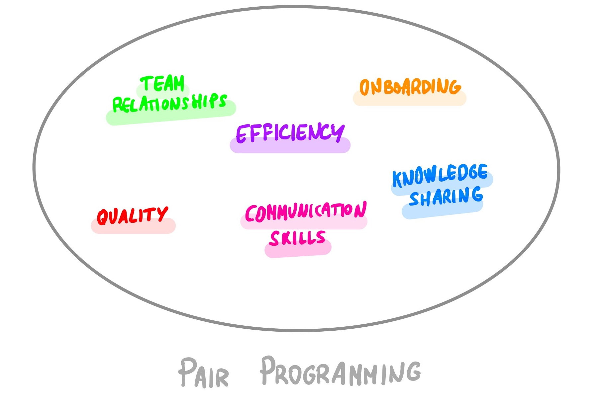
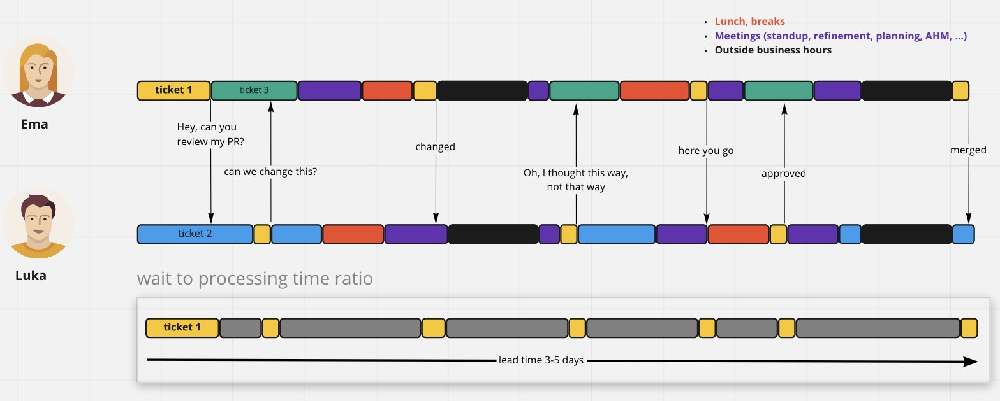

[Pair programming](http://www.extremeprogramming.org/rules/pair.html) is one of the most important practices from [Extreme Programming](http://www.extremeprogramming.org/). Although it is a well-known technique, it is rarely used in our industry.

One reason is that many people view pair programming as an ineffective technique. In terms of effectiveness, there have been many attempts to measure the performance of software teams. The problem is that they tend to focus on individual productivity: how much code people write, how many hours people work... _They focus on outputs instead of outcomes_.

However, software development is not about how fast we can write new code. The goal of any organization is to make money. **To make money, companies need to reduce the [lead time](https://itrevolution.com/measure-software-delivery-performance-four-key-metrics/) to increase production feedback**.

In this article, we will see how pair programming accelerates production feedback. We will also discuss some other benefits of pair programming, and why it is such an important practice in software development.

Hopefully, you'll decide to try it out :)

### Benefits of pair programming

It's important to be aware of the benefits a new practice should provide before you start using it. You can then evaluate if it's working, motivate yourself to keep doing it, etc. We will explore some of the benefits of pair programming in this section.

#### Team relationships

In 2015, Google wanted to discover if there were any common factors among its best-performing teams. They conducted over 200 interviews on more than 180 teams. What they found was that “**who is on a team matters less than how the team members interact, structure their work, and view their contributions**”.

Software development is a team activity. The communication that pair programming requires often leads to a stronger sense of team identity and better relationships between team members. We enjoy our success together when things go well. When things go wrong, it is also less painful for the team if they are together.

#### Knowledge Sharing

This one is the most obvious benefit of pair programming. When we do pair programming, every piece of our code is known by at least two people. A few immediate advantages at this point are:

* [Bus Factor](https://en.wikipedia.org/wiki/Bus_factor#:~:text=The%20%22bus%20factor%22%20is%20the,disappearing%20suddenly%20from%20the%20project.) problem is dramatically decreased.

* Taking holidays whenever we like does not affect the team's activity. Team initiatives are not dependent on a specific person.

Furthermore, remember that the whole team is constantly exchanging knowledge. Eventually, everyone on the team will grow dramatically. In my opinion, **there is no better strategy to spread learning than pair programming**.

#### Efficiency

Let’s go with efficiency. When we are working on a new feature, our goal is to deploy the new changes into production as soon as possible so that we can get feedback about them. As we saw in the article on [feedback loops](https://productdeveloper.net/feedback-loops/), **fast feedback has many benefits**. We would like to work on small steps, committing changes very often.

In addition to having fast feedback, we want to maintain a high level of quality within our code. To keep this level of quality, we often do code reviews before deploying code to production. A second opinion is always useful. There are several ways to conduct these reviews:

  * **Asynchronous code reviews**: Asynchronous code reviews prevent us from committing changes to production continuously, so our goal of having fast feedback is broken. Additionally, asynchronous code reviews result in a lot of wasted time and interruptions due to multiple context switches. The screenshot below illustrates this clearly, from [Dragan Stepanovic’s](https://twitter.com/d_stepanovic/) tweet:

  * **Synchronous code reviews**: to avoid interruptions and context switching, we can force our code reviews to be synchronous. However, what if we commit our changes very frequently in very small steps? We would need to interrupt our colleagues many times. It would not be effective. To have fewer interruptions, we would end up with bigger changes, which is something that we don’t want.
  * **Pair programming**: we have continuous code review with pair programming. As all the code is developed in pairs, the code review is not a separate step. All the code goes to production as soon as it’s committed.

So, as a summary:

* To work on small steps, asynchronous code review is not an option.
* With synchronous code reviews, we need a lot of coordination between the team members and we end up with bigger changes.
* Pair programming allows us to work on small steps, getting fast feedback of our changes without compromising the code quality, as the code is continuously reviewed. **Pair programming is the most effective way to work if we want to do continuous integration and continuous delivery**.

If you are interested in learning more about the different types of code reviews, I recommend reading [Edu Ferro's post on code reviews](https://www.eferro.net/2021/09/code-reviews-synchronous-and.html).

#### Quality

Collaboration generates more ideas than working alone on a problem. The more ideas we have, the easier it is to find better solutions, resulting in better quality.

Knowledge sharing also affects this quality. As the team grows due to this sharing, the overall quality of code increases.

#### Onboarding

Since pair programming improves knowledge sharing and team relationships, it is really useful when onboarding new team members.

New people will gain a much better understanding of the business domain, the code, and the entire organization with pair programming.

In addition to this, software development is a team activity. A new team member changes the dynamics of the team, as people need some time to get to know each other. Pair programming accelerates this process as people are constantly collaborating.

#### Communication skills

Communication is an undervalued and very important skill for software developers.

Pair programming forces us to share and discuss our ideas with our colleagues, instead of implementing the first solution that comes to our minds. To convince people to implement our ideas, we must explain them clearly, so our communication skills improve.

### Summary

According to the [DORA Research](https://www.devops-research.com/research.html), practices like [continuous delivery](https://cloud.google.com/architecture/devops/devops-tech-continuous-delivery), [working on small batches](https://cloud.google.com/architecture/devops/devops-process-working-in-small-batches), and having a [learning culture](https://cloud.google.com/architecture/devops/devops-culture-learning-culture) are predictors of higher software delivery and organizational performance.

With pair programming, we have seen that **production feedback is faster, team relationships are stronger, and knowledge is spread easily within the organization**. Additionally, we will improve the code quality, make a better onboarding process, and improve our communication skills.

Give it a try.

### Related content

[Lean Product Development: Resource management vs. Flow efficiency](https://www.youtube.com/watch?v=SqI9jV7afpE) - Johanna Rothman

[Code Reviews (Synchronous and Asynchronous)](https://www.eferro.net/2021/09/code-reviews-synchronous-and.html) - Edu Ferro

[The resource utilization trap.](https://www.youtube.com/watch?v=CostXs2p6r0) - Henrik Kniberg

[You must be crazy to do pair programming](https://www.youtube.com/watch?v=aItVJprLYkg) - Dave Farley

[Pair Programming Styles](https://tuple.app/pair-programming-guide/styles) - Tuple's Blog
