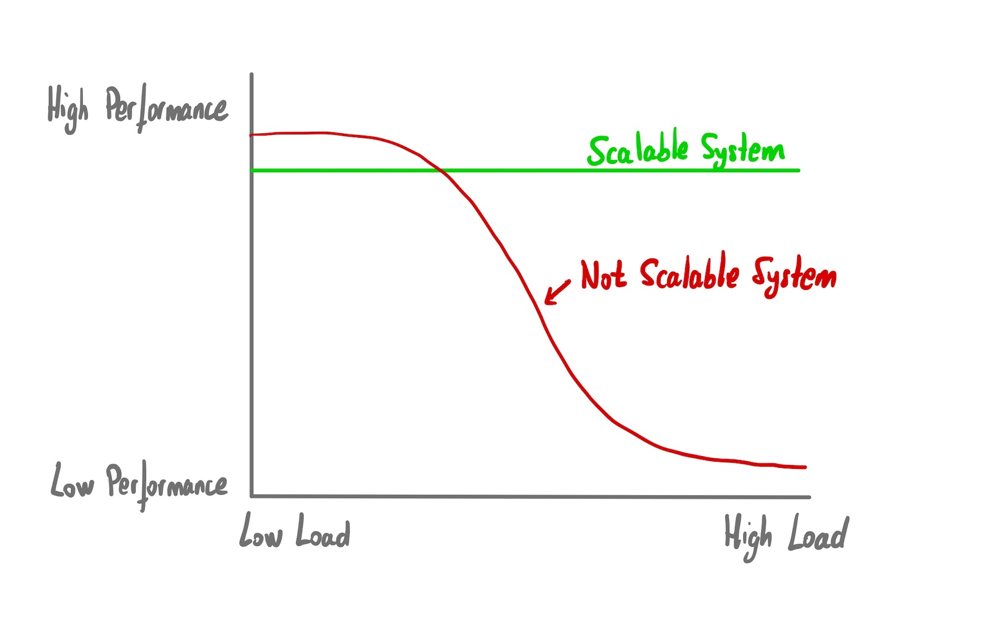

Scalability and performance are key concepts in product development, appearing in many conversations. However, it is often ignored how our product scales, leading to unexpected problems every time we face situations like a spike in the number of users or large customers using our product. Why does it happen?

Let's start with some definitions:

* **Performance** measures the speed/latency of a **single request** to our system.
* **Scalability** measures the ability of our system to **maintain its performance** under increasing load.

We can appreciate the difference in the image below:

### The problem

In my experience, performance and scalability are often considered something technical, “non-functional” requirements completely managed by technical people. Only members of development teams participate in discussions about these concepts so there are not any business objectives related to them.

This lack of business objectives leads to several undesirable situations:

* **Teams only work in a reactive way**. This is a common situation, where teams only have a reactive approach when some scalability problems appear. Usually, this happens as an incident, resulting in stress, anxiety, and poor solutions.

* **Teams invent scalability objectives**: it's really common to have development teams working on scalability problems to support a workload that does not actually exist. This is a waste of time, as we are not adding any value to the product and we may never reach that load.  \

* **Misunderstanding** about the current capacity of the product between different departments.

### Product limits

The objective of **product limits** is to set boundaries in our product in order to avoid these unexpected situations. We want to move those scalability and performance conversations from a technical problem to a business problem.

Product limits should be set in a multidisciplinary exercise, with people from different departments providing context.

A possible exercise:

1. Choose one feature of your product

2. Get a rough idea of how much load it can support without degrading its performance.

3. Discuss that load, taking into account the business objectives:

    a. Is it something acceptable for all departments? Is the current maximum load in line with the business goals? In that case, set a product limit. This limit can be a soft limit, inviting users to contact us if they have different needs. If this happens, we will have the opportunity to learn about that use case, but we will avoid unpleasant surprises.

    b. Isn’t something acceptable? Does the current maximum load not meet the business needs? It’s ok, it's the first time we're doing this exercise, so we might have existing misunderstandings. In this case, we can also set the soft limit, but we will set a **business objective** to improve the scalability of that feature. Improving the scalability of that feature will be treated as any other new feature in our product.

### Conclusion

The user experience is completely dependent on the product's performance and scalability, so it makes no sense to isolate these problems within development teams and leave other teams without any knowledge about them.

With product limits, we have seen an approach to move these concepts from a technical to a business perspective, where all teams collaborate to set limits that make sense for the product.

Have you ever run into this problem? Do you have any experience applying product limits or other similar solutions? Contact me and share it!

### Related content

Scalability: Basics, application to systems, teams, and processes: [video](https://www.youtube.com/watch?v=yPqHK5fjJ10) (Spanish) and [slides](https://docs.google.com/presentation/d/1R1aIdeE5esk06GsiOrA56mLd2NFY1bCwrpTU7CbM0P0/edit?usp=sharing)
