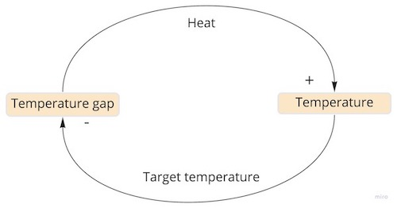
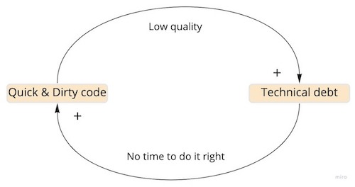

All the DevOps principles and practices can be derived from the [“Three Ways of DevOps”](https://itrevolution.com/the-three-ways-principles-underpinning-devops/):

* **The first way**: Flow/Systems Thinking
* **The second way**: Amplify Feedback Loops
* **The third way**: Culture of Continual Experimentation and Learning

These practices are well covered in both “[The DevOps Handbook](https://itrevolution.com/book/the-devops-handbook)” and the “[Phoenix Project](https://itrevolution.com/book/the-phoenix-project/)” books. In this post, we will look more closely at a concept mentioned in “the second way”: **feedback loops**. From the [“Three Ways of DevOps”](https://itrevolution.com/the-three-ways-principles-underpinning-devops/): _“The second way is about creating the right to left feedback loops. The goal of almost any process improvement initiative is to shorten and amplify feedback loops so necessary corrections can be continually made”_.

#### What are feedback loops?

In simple terms, a feedback loop is a process where the outputs of a system are used as inputs again.

Feedback loops are always running in the background of our lives. The human body is dominated by a variety of feedback loops: there are processes that ensure a proper balance of everything, from the amount of water in our cells to the number of hormones that we release. They are not only present in human biology, but also in the center of human behavior, where the outputs of many processes influence many of our decisions.

Of course, feedback loops are also present in product development. Through this post, we will explore how we can shorten and amplify these feedback loops and use them to improve our product development process. First, we will see the two types of feedback loops.

#### The two types of feedback loops

As we said, a feedback loop occurs when a change in something ultimately comes back to cause a further change in the same thing. Depending on this further change’ direction, there are two different types of feedback loop.

##### Reinforcing feedback loop

Further change is in the same direction. By increasing the value of a variable in the first entity, the value of the second entity increases, which causes the value of the first entity to increase even more. We can see it as a loop of accelerating change.

Compound interest is a classical example of a reinforcing feedback loop: imagine that you start with 100€ and get paid 10 percent interest each year. After one year, you’ll have 110€. The next time around, you get paid 10 percent interest on 110€, so you will have 121€. The loop will go on and on.

Reinforcing feedback loops can be great for building good habits or achieving peak performance in something. Of course, they can amplify the impact of bad behaviors as well.

##### Balancing feedback loop

Further change is in the opposite direction. In this case, an increase in value in the first entity causes a decrease in the second entity, which in turn leads back to a decrease in the first entity. A loop of this type causes the system to stabilize at a point where there can be no more change.

An example of a balancing feedback loop is a thermostat. Suppose we set a target temperature of 23 degrees. The lower the current temperature the greater the temperature gap. The greater the gap the more heat that flows into the system. That increases the temperature, which leads to a smaller temperature gap. It keeps going down until the gap is zero, where the system has reached the target.

Balancing feedback loops can be very effective at moderating bad habits.

#### Feedback loops in product development

During the product development process, we turn ideas into products, measure how customers respond, and adapt our product based on that feedback. Here we have the most obvious feedback loop in product development: the process of collecting customer feedback continuously and improving our product based on these insights.

But there are many other opportunities to get feedback before we put our software in front of customers:

* **Testing**: each time we execute a test, we receive feedback about the test result.
* **Merge**: when we merge our code with the main branch, we receive feedback about possible conflicts.
* **Code review**: when more people see one piece of code, there is feedback about possible improvements.
* **Deploy**: every time we deploy new code to production, we receive feedback about how it performs. Examples: how the system works with that new feature, possible incompatibilities with other features.
* **System monitoring**: we continuously have feedback about the system’s health (dashboards, alerts, etc.).
* **Release**: every time we release a new feature, we receive feedback about how it is used by customers.
* **Product instrumentation**: we receive continuous feedback about the actions that customers are doing in our product through product instrumentation tools.

As we go through all these steps, from the moment we write the first line of code to the moment we know whether a feature is being used, the results we receive shape our next decisions, **creating a feedback loop**.

#### Shortening our feedback loops

Each action has a delay between doing it and receiving feedback. The longer this delay, the slower we can react. Additionally, long delays in receiving feedback lead to other problems such as:

* A lot of wasted time on bad assumptions.
* We make a lot of wrong decisions because of the impossibility of seeing the effects of our actions. Think about that shower faucet with a long delay: you always end up frozen or burned :)

Some examples of this:

* **Working in a separate branch for a long time**: we may then discover that the main branch has changed and it is not compatible with our code.
* **A single developer works alone for a long time and the code is not compatible with the team practices**: once the problem is found in a code review, all the code has to be rewritten.
* **We don’t talk with customers before implementing a feature**: we work for a long time on implementing it. Then, the feature is not used by any customer.

To avoid these problems, **we need to adapt our processes in order to have feedback loops as fast as possible**. Remember, from [“Three Ways of DevOps”](https://itrevolution.com/the-three-ways-principles-underpinning-devops/): _“The goal of almost any process improvement initiative is to shorten and amplify feedback loops so necessary corrections can be continually made”._

Let’s look at some practices that lead to shorter feedback loops.

##### Unit testing

Unit testing is the first feedback loop that should be established on any project. Rather than running the whole application, you’re running smaller parts of code (test suites) designed to be fast. With unit testing, you can have feedback about your work in seconds.

Next, you can shorten and increase the number of feedback loops even more by practicing **test-driven development (TDD)**. One of the biggest benefits of TDD is that you run your code often. As you write the test first, you’ll automatically have rapid feedback every time you save a new change. For me, this fast feedback is one of the main reasons to practice TDD.

##### Pair/Mob Programming

Apart from the advantage of improving your knowledge by continuously explaining problems or solutions to someone else, pair/mob programming is a powerful loop technique that provides peer feedback in seconds. By having people work together, the feedback they give each other is immediate and easily applied.

As an alternative to pair/mob programming, you can conduct synchronous code reviews. You’ll lose other benefits of group programming, but we will avoid long feedback cycles.

##### Trunk based development

With [trunk-based development](https://trunkbaseddevelopment.com/), we have continuous feedback about the compatibility of the newly developed code with the main branch. We are committing new changes to the main branch continuously so we avoid long feedback loops and painful merges.

Trunk-based development is a key enabler of the next practice, continuous delivery.

##### Continuous Delivery

[Continuous Delivery](https://continuousdelivery.com/) is the ability to get changes of all types—including new features, configuration changes, bug fixes, and experiments—into production, or into the hands of users, _safely_ and _quickly_ in a _sustainable_ way.

Decoupling our deployments from our releases means that we can deploy more often, so we will have more feedback. [Feature toggles](https://martinfowler.com/articles/feature-toggles.html) are a great tool to do this.

##### Work in small batches

Work in small increments. Then deploy those small increments to production. Remember, the more time we spend working on an idea without getting feedback, the more probability we have of working on bad assumptions.

#### Amplifying our feedback loops: look for virtuous cycles

When we talk about amplifying feedback loops, we are looking for loops where each iteration of the cycle reinforces the previous one: reinforcing feedback loops.

When we get reinforcing feedback loops in a positive way we get a **virtuous cycle. **We can see an example with the level of automated testing on our product and the team's confidence.

As our product is more tested, the team will have a greater level of confidence when doing new features. Each iteration of the loop reinforces the previous one, and the levels of confidence and testing are rising continuously. This is why we want to amplify feedback loops.

However, we have to be careful, as the same positive feedback loop can also run in reverse order, creating a **vicious cycle.** Here, a bad situation feeds on itself to make it even worse. We can see an example below, with the technical debt and the code quality:

The more technical debt in our project, the more quick and dirty code we will produce. This feedback loop will be continuously running unless we stop it.

#### Conclusions

Feedback loops can be a powerful tool in our product development process. The more positive feedback loops we have, the greater control of our system and better customer satisfaction, some goals that we all want to achieve.

However, we have also seen that there are negative feedback loops that can produce some vicious cycles if we don’t identify and stop them.

The intent of this article was to assist with creating and identifying feedback loops in the product development process so we can:

* Amplify our current positive feedback loops, reaching virtuous cycles.
* Stop our current negative feedback loops, removing the vicious cycles.

This way, we can move from letting feedback loops shape our decisions in an invisible way to designing the feedback loops we want and need. **Rather than being victims of feedback loops suffering vicious cycles, we should be architects of them and benefit from virtuous cycles.**

Do you have other practices to create and identify feedback loops? [Contact me](mailto:fortizabril@gmail.com) and share your experience!

#### Related content

* The DevOps Handbook (book): [https://itrevolution.com/book/the-devops-handbook](https://itrevolution.com/book/the-devops-handbook/?_ga=2.102924932.520566917.1641551391-1413882804.1637091596)
* Small batches for the win (blog from @eferro): [https://www.eferro.net/2021/01/small-batches-for-win-continuous.html](https://www.eferro.net/2021/01/small-batches-for-win-continuous.html)
* Many Much More Smaller Steps (post from GeePaw Hill): [https://www.geepawhill.org/series/many-much-more-smaller-steps/](https://www.geepawhill.org/series/many-much-more-smaller-steps/)
* Introducing Extreme Programming: [http://www.extremeprogramming.org/introduction.html](http://www.extremeprogramming.org/introduction.html)
* The Virtuous Cycle of Velocity: What I learned about going fast at eBay and Google (talk from Randy Shoup): [https://www.youtube.com/watch?v=EwLBoRyXTOI](https://www.youtube.com/watch?v=EwLBoRyXTOI)
* Code reviews, synchronous and asynchronous (post from @eferro): [https://www.eferro.net/2021/09/code-reviews-synchronous-and.html](https://www.eferro.net/2021/09/code-reviews-synchronous-and.html)
* Equipos de algo rendimiento, qué son y cómo identificarlos: [https://www.youtube.com/watch?v=Eqwy6w2RYUk](https://www.youtube.com/watch?v=Eqwy6w2RYUk)

**Note**: this article was improved with the feedback from: [Jorge](https://twitter.com/gardenunez), [Edu](https://twitter.com/eferro) and [Nacho](https://twitter.com/saski). Thanks!
